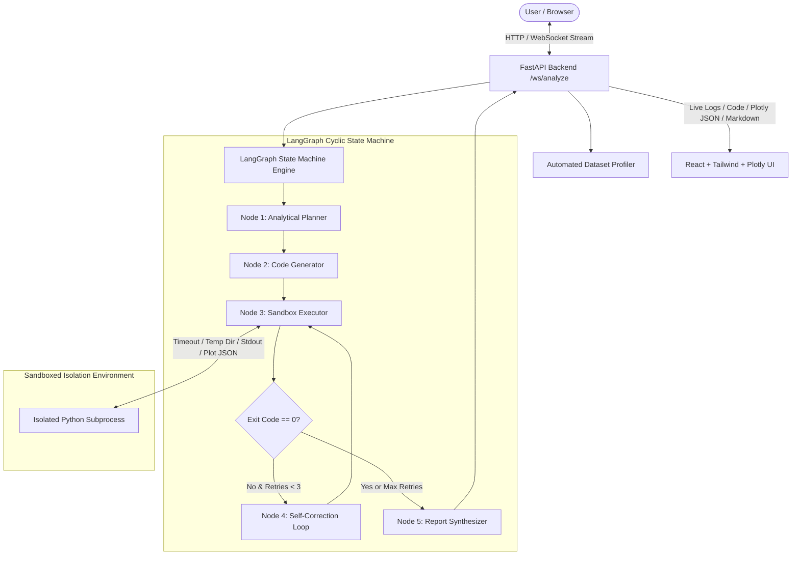

# 🧠 Autonomous Data Analysis Agent

An enterprise-grade, stateful AI agent platform that enables non-technical users to upload structured datasets (CSV, Excel, JSON, SQLite) and ask high-level questions in natural language. Powered by **LangGraph**, **FastAPI**, and an **isolated Python sandbox runtime**, the agent autonomously plans analyses, generates Python (Pandas/Plotly) code, executes code safely, self-corrects on runtime errors, and streams live progress, visualizations, and summary reports to a modern React UI.

---

## 🏗️ High-Level System Architecture



---

## 🚀 Key Features

1. **Automated Dataset Profiling**:
   - Instant schema detection, data type inference, missing value percentages, unique counts, and numerical distributions (mean, std, min, max, quartiles).
   - Supports `.csv`, `.xlsx`, `.xls`, `.json`, and `.sqlite` formats.

2. **LangGraph Stateful Loops & Self-Correction**:
   - Multi-step cyclical graph architecture (`StateGraph`).
   - If Python code encounters syntax errors, `KeyError`, dtype mismatches, or timeouts, the stack trace is fed back to the LLM to inspect the offending code and auto-correct up to 3 retries.

3. **Subprocess Sandbox Runtime**:
   - Isolated temporary directory per execution run.
   - Guardrailed execution with strict timeouts (default 15s) and memory caps.
   - Headless Plotly figure interception: plots generated via `px` or `go` are automatically captured, converted into structured JSON, and streamed to the UI.

4. **Real-Time Streaming UX**:
   - WebSocket streaming logs every phase: Planning, Code Generation, Execution, Self-Correction, and Synthesis.
   - Interactive terminal view with syntax-highlighted code diffs/attempts.
   - Interactive Plotly chart renderer (zoom, pan, hover, download) alongside an executive Markdown intelligence report.

---

## 📁 Repository Directory Structure

```
Agentic_AI_Project/
├── backend/
│   ├── app/
│   │   ├── __init__.py
│   │   ├── config.py         # Pydantic BaseSettings, environment configuration
│   │   ├── schemas.py        # Pydantic v2 data models for API & WebSocket
│   │   ├── profiler.py       # Automated dataset schema & summary stats extractor
│   │   ├── sandbox.py        # Subprocess code runner with timeout & Plotly interceptor
│   │   ├── agent.py          # LangGraph state machine & multi-provider LLM factory
│   │   └── main.py           # FastAPI app, upload endpoint & WebSocket streamer
│   ├── uploads/              # Storage directory for uploaded datasets
│   ├── .env.example          # Environment variables template
│   └── requirements.txt      # Python dependencies
├── frontend/
│   ├── src/
│   │   ├── components/
│   │   │   ├── Header.tsx           # Navigation bar with agent status badges
│   │   │   ├── DatasetUpload.tsx    # Drag-and-drop uploader + Demo dataset loader
│   │   │   ├── DatasetPreview.tsx   # Schema table, missing data ratios, and sample grid
│   │   │   ├── AgentTerminal.tsx    # Terminal streaming logs, multi-step chips & code viewer
│   │   │   ├── ReportView.tsx       # Interactive Plotly viewer & Markdown summary reader
│   │   │   └── QueryInput.tsx       # Query bar, model selector & prompt chips
│   │   ├── types/
│   │   │   └── index.ts             # TypeScript definitions
│   │   ├── App.tsx                  # Master dashboard coordinating state & WebSockets
│   │   ├── main.tsx                 # React entrypoint
│   │   └── index.css                # Tailwind directives & dark theme glassmorphism
│   ├── package.json
│   ├── vite.config.ts
│   └── tailwind.config.js
├── sample_data/
│   └── sales_performance.csv       # Plug-and-play sample dataset
├── main.py                          # Root convenience runner
└── README.md
```

---

## ⚡ Quick Start Guide

### 1. Backend Setup

1. Open a terminal in the project root:
   ```bash
   cd backend
   ```

2. Create and activate a Python virtual environment:
   ```bash
   # Windows (PowerShell)
   python -m venv venv
   .\venv\Scripts\Activate.ps1

   # Linux / macOS
   python3 -m venv venv
   source venv/bin/activate
   ```

3. Install required Python packages:
   ```bash
   pip install -r requirements.txt
   ```

4. Configure environment variables:
   ```bash
   cp .env.example .env
   ```
   Edit `.env` to provide your API keys:
   ```ini
   OPENAI_API_KEY=sk-...
   # Or ANTHROPIC_API_KEY=sk-ant-...
   DEFAULT_LLM_PROVIDER=openai
   DEFAULT_MODEL_NAME=gpt-4o
   ```
   *(Note: If no API key is provided, the backend falls back to an intelligent mock generator so you can test end-to-end functionality right away!)*

5. Start the FastAPI backend server:
   ```bash
   uvicorn app.main:app --reload --port 8000
   ```
   The backend will be live at `http://localhost:8000`. You can inspect the Swagger API docs at `http://localhost:8000/docs`.

---

### 2. Frontend Setup

1. Open a second terminal window:
   ```bash
   cd frontend
   ```

2. Install Node dependencies:
   ```bash
   npm install
   ```

3. Start the Vite development server:
   ```bash
   npm run dev
   ```

4. Open your browser and navigate to `http://localhost:5173`.

---

## 🧪 Testing the Autonomous Agent

1. Click **"Load Demo Sales Dataset"** (or drag and drop `sample_data/sales_performance.csv`).
2. Observe the automated schema profiler compute row counts, data types, missing ratios, and statistical distributions.
3. Select an analytical query chip, e.g.:
   - *"Break down total sales and profit margins across regions"*
   - *"Identify correlation between discount rates and sales volume"*
   - *"Find top 5 customer segments generating highest profit"*
4. Watch the **Agent Terminal**:
   - **Step 1 [Planner]**: Builds a 4-step analytical sequence.
   - **Step 2 [Code Generator]**: Generates executable Python Pandas and Plotly code.
   - **Step 3 [Code Executor]**: Runs code inside the isolated sandbox and captures stdout and Plotly JSON.
   - **Step 4 [Self-Correction]** *(if error)*: Catches tracebacks, inspects offending lines, and re-executes automatically.
   - **Step 5 [Synthesizer]**: Renders the interactive Plotly graph and formats an executive intelligence report in Markdown.
5. Zoom, pan, and hover over the generated Plotly visualization or export the report as a Markdown document.

---

## 🔒 Security & Sandbox Guardrails

- **Subprocess Isolation**: Code executes in a temporary, disposable directory to isolate file system operations.
- **Strict Execution Timeouts**: Subprocesses are terminated if execution exceeds `MAX_EXECUTION_TIME` (default 15 seconds), preventing infinite loops.
- **Headless Plot Interception**: The sandbox patches `plotly.io.show` to serialize figure specs into `output_plot.json` without hanging headless servers or opening local browser tabs.
- **Configurable Max Retries**: Limits self-correction loops to avoid infinite token consumption (default: 3 retries).
